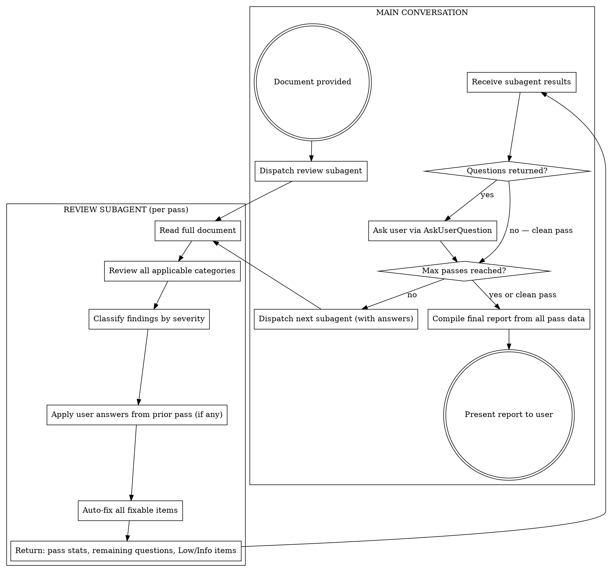

# Iterative Document Review

## Overview

Systematically review a document through repeated passes, fixing ALL issues found each pass, then re-reviewing until no critical, high, or medium severity issues remain. Produces a final summary report.

**Core principle:** One-pass reviews miss things. Fix-then-re-review catches cascading issues that only surface after earlier gaps are closed.

## When to Use / When NOT to Use

**Use for:** Specs, plans, PRDs, architecture docs, proposals, RFCs, runbooks, design docs — any structured document that will drive decisions or implementation.

**Do NOT use for:** Code reviews, changelogs, single-paragraph user stories, meeting notes, or documents shorter than ~half a page. Those don't benefit from iterative multi-pass review.

## Process

Review passes run as **subagents**; the main conversation coordinates the loop and handles user interaction.



## Severity Levels

| Severity | Definition | Action |
|----------|-----------|--------|
| **Critical** | Blocks implementation or creates serious risk. Missing requirements, contradictions, security holes. | Must fix |
| **High** | Significant gap that will cause rework or confusion. Vague requirements, missing error flows, underdefined components. | Must fix |
| **Medium** | Weakness that should be addressed. Missing edge cases, incomplete specs, unclear ownership. | Must fix |
| **Low** | Minor improvement. Wording clarity, formatting, nice-to-haves. | Fix alongside higher-severity items; leave unfixed only if no higher-severity items remain |
| **Info** | Observation or suggestion. Not a deficiency. | Note in report only |

**Exit criteria:** The loop ends when a pass produces ZERO Critical, High, or Medium findings. Any Low items found in that final pass are noted in the report but do not trigger another pass. Low items found in earlier passes (alongside higher-severity items) should be fixed in that same pass.

**Safety valve:** Default max passes is 5. If the user specifies a different limit (e.g., "max 3 passes"), use that instead. If the limit is reached without converging, stop and present the report with a note that the document may need structural rework before further review is productive.

### Loop Protection

Fixes can introduce new issues. Watch for these patterns:

- **Oscillation** — If you fix something in pass N and a later pass flags the same area again, do NOT revert. Instead, flag it as `[REVIEW NOTE: This section was revised in pass N but may need stakeholder alignment]` and classify as Info so it doesn't block the loop.
- **Rising issue count** — If a pass produces MORE Critical/High/Medium findings than the previous pass, pause and assess whether your fixes are creating problems. If so, consider smaller, more targeted fixes rather than adding large new sections.
- **Same finding recurring** — If the exact same finding appears in two consecutive passes (you fixed it but it came back), flag it as a `[REVIEW NOTE]` and downgrade to Info. Don't keep fixing the same thing.

The goal is convergence. If the issue count isn't trending down across passes, something is wrong with the fixes, not the document.

## Review Categories

Each pass should examine all **applicable** categories. Skip categories that don't apply to the document type (e.g., "Data & Integration" is irrelevant for a project proposal). If a category doesn't apply, silently skip it — don't note it as N/A.

1. **Completeness** — Are all necessary sections present? Are requirements specific and testable? Are acceptance criteria defined?
2. **Consistency** — Do sections contradict each other? Are terms used uniformly? Do numbers/thresholds agree across sections?
3. **Clarity** — Are requirements vague or ambiguous? Can a developer act on them without guessing?
4. **Feasibility** — Are there technical constraints not addressed? Are assumptions stated?
5. **Security & Compliance** — PII handling, auth, access control, regulatory requirements?
6. **Error Handling & Edge Cases** — Failure modes, retry logic, graceful degradation, circuit breakers?
7. **Data & Integration** — Data models sufficient? API contracts complete? External dependencies identified with owners?
8. **Operational Readiness** — Monitoring, logging, alerting, deployment, rollback, migration strategy?
9. **Roles & Permissions** — Who can do what? Are user roles defined? Is access control specified?
10. **Testing & Validation** — How will this be tested? Are there testable acceptance criteria? Performance benchmarks?
11. **Versioning & Compatibility** — API versioning? Schema evolution? Backwards compatibility with existing systems?
12. **Dependencies & Sequencing** — Cross-team dependencies? External service availability? Build/deploy order?

## How to Fix

When fixing, edit the document directly:
- Replace vague language with specific, measurable requirements
- Add missing sections, fields, or flows
- Resolve contradictions by choosing the correct interpretation
- Add detail to underdefined components

**Do NOT delete content.** Add to it, refine it, or flag it — never remove the user's original intent.

**Fixes must be atomic.** Each fix should address exactly one finding and touch only the language specific to that issue. Do not rewrite surrounding sentences, reword adjacent paragraphs, or "improve" nearby content while you're in there. If adjacent text has its own problem, that's a separate finding with its own fix. A fix for a single finding CAN be substantial (an entire new section for a "missing monitoring section" finding) — atomic means one finding per fix, not small per fix.

**Write real content, not TODOs.** A fix is the actual specification content a developer needs — not a placeholder like "add more detail here." If you don't have enough domain context, batch the question for the user rather than guessing (see below).

### Auto-fix vs. Ask the User

Not everything should be auto-fixed. Some findings require user input because you lack the domain context to make the right call.

**Auto-fix (you have enough context):**
- Vague language → make specific and measurable
- Missing error handling, retry logic, edge case flows
- Incomplete data models (add obviously missing columns/fields)
- Consistency fixes (resolve contradictions where the correct choice is clear)
- Adding operational sections (monitoring, logging, alerting)
- Structural improvements (formatting, organization, missing section headers)

**Ask the user (you don't have enough context):**
- Missing business requirements — don't invent requirements the user never stated
- Business rules, SLAs, or thresholds that depend on stakeholder decisions
- Scope decisions (MVP vs. full feature, which phase something belongs to)
- Technology or vendor choices the user hasn't specified
- Domain-specific logic you can't confidently infer from the document
- Priority or sequencing decisions between competing concerns

### Subagent review pass

Each review pass is dispatched as a subagent with this prompt structure:
1. **Document path** — the file to review
2. **User answers** (if any) — answers from the prior pass's questions, to apply as fixes before reviewing
3. **Pass number** — for tracking
4. **Instructions** — review all applicable categories, classify findings, apply user answers, auto-fix what you can, return structured results

The subagent must return a structured response containing:
- **Pass stats** — counts by severity (Critical, High, Medium, Low, Info)
- **Auto-fixes applied** — bulleted summary of what was changed
- **Questions for user** — items needing user input, each with context and suggested options
- **Remaining Low/Info items** — noted but not blocking

### Main conversation flow

The main conversation orchestrates the loop:
1. Dispatch review subagent (pass 1)
2. Receive results — if questions were returned, ask the user via AskUserQuestion and **wait for answers**
3. If no Critical/High/Medium remain and no questions: exit loop, compile final report
4. Otherwise: dispatch next subagent with user answers + pass number
5. Repeat until clean or max passes reached

## Final Report Format

After the loop exits, the main conversation compiles the final report from all subagent pass data:

```
## Document Review Report

**Document:** [name]
**Passes completed:** [N]
**Final status:** PASS — no Critical/High/Medium issues remain | INCOMPLETE — max passes reached with [N] actionable issues remaining

### Pass Summary
| Pass | Issues Found | Critical | High | Medium | Low | Info |
|------|-------------|----------|------|--------|-----|------|
| 1    | ...         | ...      | ...  | ...    | ... | ...  |
| 2    | ...         | ...      | ...  | ...    | ... | ...  |
| N    | 0 actionable| 0        | 0    | 0      | ... | ...  |

### Remaining Low/Info Items
- [List any Low or Info items from the final pass]

### Key Changes Made
- [Bulleted summary of the most significant fixes applied across all passes]

### Items Requiring Stakeholder Input
- [Any REVIEW NOTE items flagged in the document — oscillation flags, recurring findings, or unresolved questions]
```

## Red Flags — You're Cutting Corners

- Reporting issues without fixing them
- Doing one pass and stopping because "the issues are significant enough"
- Splitting review categories across separate passes instead of checking all categories each pass
- Skipping the re-review after fixes ("I already know what I fixed")
- Not classifying severity on every finding
- Stopping because you found "enough" issues

**All of these mean: you're not following the process. Go back to the loop.**

| Rationalization | Reality |
|----------------|---------|
| "The issues are significant enough to warrant a rewrite before further review" | No. Fix them and re-review. The iterative process handles this. |
| "One more pass would be worthwhile but I'll stop here" | If you think another pass would find things, do the pass. |
| "I'll organize my review by category across separate passes" | Every pass checks ALL categories. Themed passes miss cross-cutting issues. |
| "These are just observations, not actionable findings" | If a developer would be blocked, confused, or forced to guess, it's actionable. Classify it. |
| "I've already reviewed what I just fixed" | Fixes create new context. New context creates new issues. Re-review the whole document. |
| "My fixes keep creating new issues so I need more passes" | If issue count is rising, your fixes are too aggressive. Make smaller, targeted fixes. If the same issue recurs, flag it as a REVIEW NOTE and move on. |

## Common Mistakes

| Mistake | Fix |
|---------|-----|
| Stopping after first pass with a long findings list | Fix everything, then re-review. Findings are not the deliverable — a clean document is. |
| Vague fixes ("add more detail here") | Write the actual detail. Don't punt to the user. |
| Missing cascading issues | After fixing gaps, new inconsistencies may appear. That's why you re-review. |
| Over-classifying as Low to exit early | If a developer would be blocked or confused, it's Medium or higher. |
| Enormous single pass | If a pass exceeds 20 findings, that's fine — fix them all and continue. |
