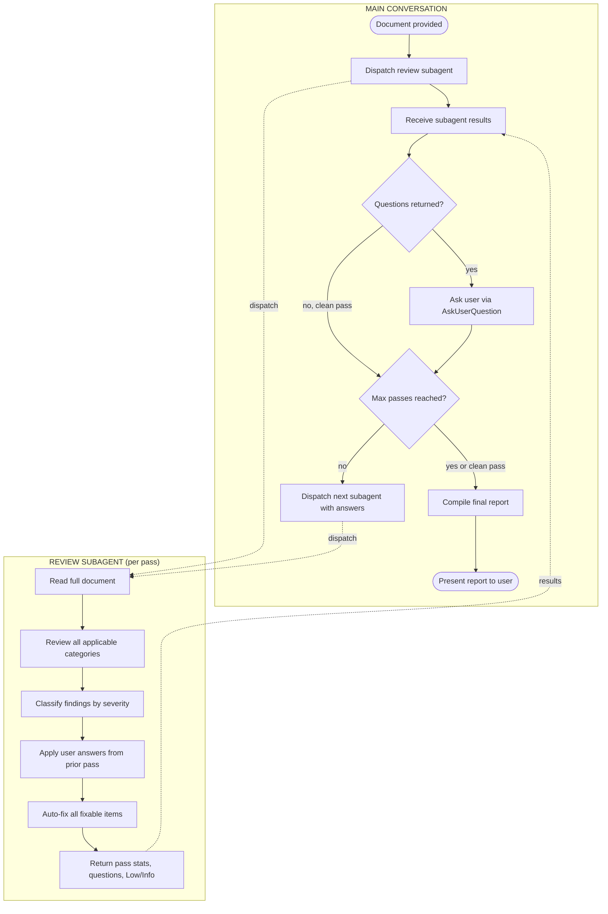

# Iterative Document Review

## Overview

Systematically review a document through repeated passes, fixing ALL issues found each pass, then re-reviewing until no Critical, High, or Medium severity issues remain. Produces a final summary report.

**Core principle:** One-pass reviews miss things. Fix-then-re-review catches cascading issues that only surface after earlier gaps are closed.

## When to Use / When NOT to Use

**Use for:** Specs, plans, PRDs, architecture docs, proposals, RFCs, runbooks, design docs — any structured document that will drive decisions or implementation.

**Do NOT use for:** Code reviews, changelogs, single-paragraph user stories, meeting notes, or documents shorter than ~half a page. Those don't benefit from iterative multi-pass review.

## Process

Review passes run as **subagents**; the main conversation coordinates the loop and handles user interaction.



### Subagent configuration

Each review pass is dispatched as a subagent with:

- **Agent type:** `general-purpose` (or any agent with file read/write/edit tools)
- **Required tools:** `Read`, `Edit`, `Write`, `Grep`, `Glob`
- **Extended thinking:** Enable thinking for classification reasoning — reviewers systematically under-classify without it
- **Isolation:** Each pass runs in a fresh subagent context. This is deliberate: fresh context prevents the reviewer from rationalizing past decisions and catches cascading issues

### Tracking progress

Use `TaskCreate` to create one task per planned pass (e.g., "Pass 1", "Pass 2"…) before the loop starts. `TaskUpdate` each pass to `in_progress`/`completed` as the loop runs. This gives the user real-time visibility into where the review stands without needing narration between passes.

### Long-document fanout (optional)

For documents over ~20K tokens (roughly 30+ pages), pass 1 MAY fan out parallel subagents — one per top-level section — that each return findings without fixing. The main conversation consolidates their findings, dispatches a normal serial subagent to apply fixes, then resumes the standard serial loop from pass 2. Do NOT fan out after pass 1; fixes create cross-section dependencies that parallel reviewers can't see.

## Severity Levels

| Severity | Definition | Action |
|----------|-----------|--------|
| **Critical** | Blocks implementation or creates serious risk. Missing requirements, contradictions, security holes. | Must fix |
| **High** | Significant gap that will cause rework or confusion. Vague requirements, missing error flows, underdefined components. | Must fix |
| **Medium** | Weakness that should be addressed. Missing edge cases, incomplete specs, unclear ownership. | Must fix |
| **Low** | Minor improvement. Wording clarity, formatting, nice-to-haves. | Fix when a pass already has Critical/High/Medium work; skip when the pass would otherwise be clean |
| **Info** | Observation or suggestion. Not a deficiency. | Note in report only |

**Exit criteria:** The loop ends when a pass produces zero Critical/High/Medium findings. Low items from that final clean pass are listed in the report but do not trigger another pass.

**Safety valve:** Default max passes is 5. If the user specifies a different limit (e.g., "max 3 passes"), use that. If the limit is reached without converging, stop and present the report — see "INCOMPLETE outcome" below for next steps.

### Worked examples of classification

| Finding (abbreviated) | Severity | Reasoning |
|---|---|---|
| "System must authenticate users" with no auth mechanism, session handling, or token storage specified | **Critical** | Blocks implementation entirely; security-sensitive |
| Section 3 says response time target is 200ms; section 7's SLA table says 500ms | **Critical** | Direct contradiction — implementation would pick one arbitrarily |
| Error states for the payment flow aren't specified (only happy path) | **High** | Forces implementer to invent business rules |
| Data model has `user_id` but ownership/tenancy model isn't described | **High** | Implementer will guess at multi-tenant boundaries |
| Bulk import endpoint doesn't specify batch size limit | **Medium** | Implementer can pick a reasonable default but will likely be wrong |
| Acceptance criteria use "fast" and "responsive" without numeric thresholds | **Medium** | Testable only by guess |
| Heading "Data Mgmt." is inconsistent with "Data Management" used elsewhere | **Low** | Cosmetic; no implementation impact |
| Section ordering feels chronological instead of by subsystem | **Info** | Stylistic observation, not a gap |

### Loop Protection

Fixes can introduce new issues. Watch for these patterns:

- **Oscillation** — If pass N fixes something and pass N+K flags the same area again, do NOT revert. Flag it as `[REVIEW NOTE: revised in pass N, may need stakeholder alignment]` and classify as Info so it doesn't block the loop.
- **Rising issue count** — If a pass produces MORE Critical/High/Medium findings than the prior pass, your fixes are too aggressive. Switch to smaller, targeted fixes instead of adding large new sections.
- **Same finding recurring** — If the exact same finding appears in two consecutive passes (you fixed it, it came back), flag it `[REVIEW NOTE]` and downgrade to Info. Don't keep fixing the same thing.

The goal is convergence. If issue count isn't trending down, something is wrong with the fixes, not the document.

## Review Categories

Each pass examines all **applicable** categories. Skip silently if a category doesn't apply (e.g., "Data & Integration" is irrelevant for a project proposal) — don't note N/A in the report.

1. **Completeness** — All necessary sections present? Requirements specific and testable? Acceptance criteria defined?
2. **Consistency** — Sections contradict? Terms used uniformly? Numbers/thresholds agree across sections?
3. **Clarity** — Requirements vague or ambiguous? Can a developer act without guessing?
4. **Feasibility** — Technical constraints addressed? Assumptions stated?
5. **Security & Compliance** — PII handling, auth, access control, regulatory requirements?
6. **Error Handling & Edge Cases** — Failure modes, retry logic, graceful degradation, circuit breakers?
7. **Data & Integration** — Data models sufficient? API contracts complete? External dependencies identified with owners?
8. **Operational Readiness** — Monitoring, logging, alerting, deployment, rollback, migration strategy?
9. **Roles & Permissions** — Who can do what? User roles defined? Access control specified?
10. **Testing & Validation** — How is this tested? Testable acceptance criteria? Performance benchmarks?
11. **Versioning & Compatibility** — API versioning? Schema evolution? Backwards compatibility?
12. **Dependencies & Sequencing** — Cross-team dependencies? External service availability? Build/deploy order?

## How to Fix

When fixing, edit the document directly:

- Replace vague language with specific, measurable requirements
- Add missing sections, fields, or flows
- Resolve contradictions by choosing the correct interpretation
- Add detail to underdefined components

**Do NOT delete content.** Add to it, refine it, or flag it — never remove the user's original intent.

**Fixes must be atomic.** One finding per fix. Don't rewrite surrounding sentences or "improve" adjacent content while you're in there. If adjacent text has its own problem, that's a separate finding with its own fix. Atomic means *one finding per fix*, not *small per fix* — a "missing monitoring section" finding legitimately produces a whole new section.

**Write real content, not TODOs.** A fix is the actual specification a developer needs — not "add more detail here." If you lack domain context, batch the question for the user rather than guessing.

### Auto-fix vs. Ask the User

**Auto-fix (subagent has enough context):**
- Vague language → specific and measurable
- Missing error handling, retry logic, edge case flows
- Incomplete data models (add obviously missing fields)
- Consistency fixes where the correct choice is clear
- Adding operational sections (monitoring, logging, alerting)
- Structural improvements (formatting, organization, section headers)

**Ask the user (context requires stakeholder input):**
- Missing business requirements — don't invent requirements the user never stated
- Business rules, SLAs, or thresholds that depend on stakeholder decisions
- Scope decisions (MVP vs. full feature, phase assignment)
- Technology or vendor choices the user hasn't specified
- Domain-specific logic you can't confidently infer
- Priority/sequencing between competing concerns

### Returning questions to the main conversation

Questions flow: **subagent → main conversation → `AskUserQuestion` tool → user**. The main conversation is subject to `AskUserQuestion`'s constraints, so subagents must produce output that maps cleanly.

Per batch, the subagent should return **at most 4 questions**, each with **2–4 discrete options**. If the subagent produces more findings than fit, it must prioritize by severity (Critical/High first) and defer the rest to subsequent passes. Each option should be a concrete choice (e.g., "Retain legacy API v1 through EOY 2026", "Deprecate on next release") — not free-text prompts.

Subagent response format:

```yaml
pass_stats:
  critical: 0
  high: 2
  medium: 3
  low: 4
  info: 1
auto_fixes:
  - "Added retry/backoff spec to payment webhook section"
  - "Resolved SLA contradiction (standardized on 500ms)"
questions_for_user:
  - question: "What's the retention window for audit logs?"
    context: "Section 6 requires audit logging but never specifies retention."
    options:
      - "30 days"
      - "1 year"
      - "7 years (compliance default)"
remaining_low_info:
  - "Heading case inconsistency in section 4 (Low)"
```

### Main conversation flow

1. Dispatch review subagent (pass 1).
2. Receive results. If `questions_for_user` is non-empty, call `AskUserQuestion` with up to 4 questions and **wait for answers**.
3. If no Critical/High/Medium remain and no questions: exit loop, compile final report.
4. Otherwise: dispatch next subagent with user answers + pass number.
5. Repeat until clean or max passes reached.

## Final Report Format

After the loop exits, the main conversation compiles the report from all subagent pass data. **Before presenting, verify:** confirm pass N's `pass_stats` show `critical: 0, high: 0, medium: 0` for a PASS claim. If numbers don't match the claim, correct the claim — no success claims without evidence.

```
## Document Review Report

**Document:** [name]
**Passes completed:** [N]
**Final status:** PASS — no Critical/High/Medium issues remain
             | INCOMPLETE — max passes reached with [N] actionable issues remaining

### Pass Summary
| Pass | Issues Found | Critical | High | Medium | Low | Info |
|------|-------------|----------|------|--------|-----|------|
| 1    | ...         | ...      | ...  | ...    | ... | ...  |
| 2    | ...         | ...      | ...  | ...    | ... | ...  |
| N    | 0 actionable| 0        | 0    | 0      | ... | ...  |

### Remaining Low/Info Items
- [List any Low or Info items from the final pass]

### Key Changes Made
- [Bulleted summary of the most significant fixes applied across passes]

### Items Requiring Stakeholder Input
- [REVIEW NOTE items: oscillation flags, recurring findings, unresolved questions]
```

### INCOMPLETE outcome — what next

When max passes reached with actionable issues still open:

1. **Don't just present and stop.** Tell the user why convergence failed — usually one of: the document has structural issues that need human rework; fixes are revealing deeper scope ambiguity; or stakeholder decisions are blocking progress.
2. **Offer three options:** (a) raise the pass limit and continue, (b) hand the document back to the author for restructuring, (c) run targeted passes on specific sections only.
3. **List the top 3 unresolved issues** at the end of the report so the user knows exactly what's blocking convergence.

## Anti-Patterns

The following mean you're not following the process. If you catch yourself thinking or doing any of these, return to the loop.

| Rationalization | Reality |
|----------------|---------|
| "The issues are significant enough to warrant a rewrite before further review" | No. Fix them and re-review. The iterative process handles this. |
| "One more pass would be worthwhile but I'll stop here" | If you think another pass would find things, do the pass. |
| "I'll organize my review by category across separate passes" | Every pass checks ALL categories. Themed passes miss cross-cutting issues. |
| "These are just observations, not actionable findings" | If a developer would be blocked, confused, or forced to guess, it's actionable. Classify it. |
| "I've already reviewed what I just fixed" | Fixes create new context. New context creates new issues. Re-review the whole document. |
| "My fixes keep creating new issues so I need more passes" | Issue count rising means fixes are too aggressive. Smaller, targeted fixes. If the same issue recurs, flag `[REVIEW NOTE]` and move on. |
| "I can skip re-reading sections I just wrote" | You can't. Fresh read, every pass. |
| "Findings list is the deliverable" | A clean document is the deliverable. Findings without fixes are half the work. |
| "I'll punt this with 'add more detail here'" | Write the actual detail or batch as a user question. Never TODO placeholders. |
| "I'll over-classify as Low to exit early" | If a developer would be blocked, it's Medium or higher. |
